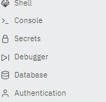
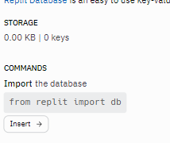
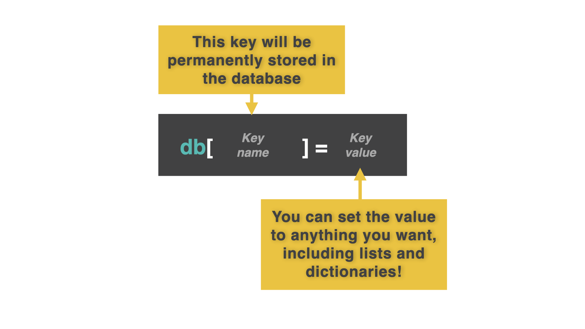
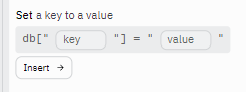
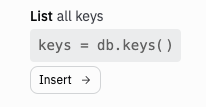
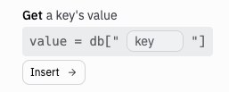
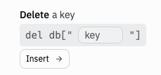

# Replit DB

Replit DB (Database) is a Replit specific feature that allows you to store data directly in a repl using a built-in database.

We've spent time learning about files, lists and dictionaries as data storage methods because sometimes, *gasp*, you might want to write code outside of Replit too, and these are all common approaches to storage across multiple platforms.

While you're here though, you can use Replit DB to easily and permanently store data with very little code. Everything we store in the database is permanentely stored in the repl.  

We know...we're awesome 😊😊

However every user that uses this will get their own unique database unless you're using a client-server model. This means that it's great for independent data store, but not for sharing data amongst multiple people - unless you're building a server. We'll get to that later in the 100 days.


## All About That 'base

👉 Let's import the built-in replit DB library. Select the 'Database' option from your dock on the bottom left. Then, drag and drop the database tab into your `main.py` tab. 

*Note: If you do not do this, you will see 'copy' instead of 'insert' within the database commands.




👉 When you're done, click 'Insert' on the 'Import the database' option to get this code.


```python
from replit import db
```

That's it! No, really.


## Storing Data
Now let's store some information. To do this, we use keys and values in a very similar way to a dictionary.



Choose 'Set a key to a value':


👉 We'll call our key 'test' and set the value to 'Hello there'.

```python
from replit import db

db["test"] = "Hello there"
```
When you `run` the code, nothing is printed. Not to worry. The key will be created and stored behind the scenes. **You don't need the key creation code any more.**  Notice how it isn't in any further example code.


## Acessing Data


### All keys
👉 Now choose 'List all keys' and `run` this code to get the program to print out all of the keys.




```python
from replit import db

keys = db.keys()
print(keys)
```

### Single key

*Note: If the key doesn't exist, the program will throw a KeyError and crash, so harness your `try.... except` powers.*

👉 To access a single key, choose 'Get a key's value' from the menu. In this example, 'test' is the key's value. We can then print it out.



```python
from replit import db

value = db["test"]
print(value)
```


## Removing Data

👉 Select - yep, you got it - 'Delete a key' from the menu. Then add the name of your key.



```python
from replit import db

del db["test"]
```

## Accessing By Prefix

If we have a bunch of keys that start with the same text, then we can access them by prefix too. In this code, I've used usernames.

```python
from replit import db

db["login1"] = "david"
db["login2"] = "pamela"
db["login3"] = "sian"
db["login4"] = "ian"
```

👉 Now I can use `.prefix()` to search for all the keys that start with 'login'.

```python
from replit import db

matches = db.prefix("login")
print(matches)
```


### Try it out!