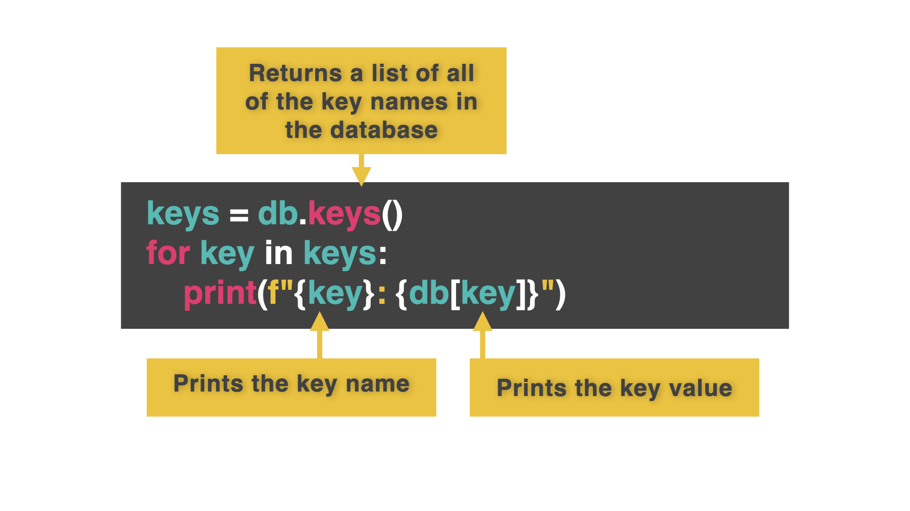

# Looping Access

One of the things you might want to do is access all the keys and loop through them. 



👉 Here's how:

```python
from replit import db

keys = db.keys()
for key in keys:
  print(f"""{key}: {db[key]}""")
```

### Try it out!